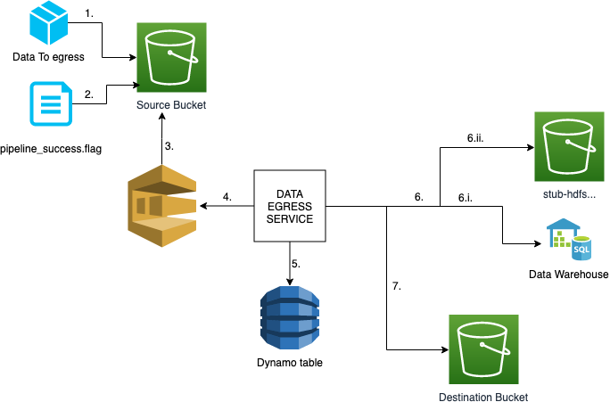

# dataworks-aws-data-egress

## A repo for Dataworks AWS Data Egress service infrastructure

This repo contains Makefile and base terraform folders and jinja2 files to fit the standard pattern.
This repo is a base to create new Terraform repos, renaming the template files and adding the githooks submodule, making the repo ready for use.

Running aviator will create the pipeline required on the AWS-Concourse instance, in order pass a mandatory CI ran status check.  this will likely require you to login to Concourse, if you haven't already.

After cloning this repo, please generate `terraform.tf` and `terraform.tfvars` files:  
`make bootstrap`

In addition, you may want to do the following: 

1. Create non-default Terraform workspaces as and if required:  
    `make terraform-workspace-new workspace=<workspace_name>` e.g.  
    ```make terraform-workspace-new workspace=qa```

1. Configure Concourse CI pipeline:
    1. Add/remove jobs in `./ci/jobs` as required 
    1. Create CI pipeline:  
`aviator`

## Data egress
The [data egress](https://github.com/dwp/dataworks-data-egress) task is responsible for receiving messages from a SQS queue, retrieving
a configuration DynamoDb item for the message and then sending files to a destination location (another S3 bucket or to disk).



1. Data is uploaded to source s3 bucket
2. `pipeline_success.flag` file is uploaded to same file path as data
3. New SQS item added on new `pipeline_success.flag` file upload with path to file as datasource
4. Egress service picks up jobs from SQS queue
5. Egress service queries Dynamo to get what action needs to be taken with the data (set in `data-egress.tf`)
6. If `transfer_type` is SFT the data is copied to a local directory and picked up by the SFT Service
   1. Prod environment: the data is sent to the corresponding data warehouse location
   2. Non-prod environment: the data is sent to the `stub-hdfs-***` bucket
7. If `transfer_type` is S3 the data is sent to the corresponding S3 location

### Database items
| Row      | Description |
| ----------- | ----------- |
| source_prefix      | **Partition key**. The S3 path to retrieve files for     |
| pipeline_name   | **Sort key**: The pipeline which sent the files        |
| decrypt   | Whether the files need to be decrypted        |
| destination_bucket   | The S3 bucket to send files to. Blank for SFT        |
| destination_prefix   | The folder path to save files to        |
| recipient_name   | Team name for the receiving files        |
| source_bucket   | S3 bucket location of the files to send        |
| transfer_type   | How to send the files, S3 or SFT        |

If source data is required to be sent via S3 and SFT, append the transfer type to pipeline_name
```
pipeline_name#sft
```


## SFT Agent

The SFT Agent reads files written to disk by the data egress service and sends these to configured destinations via HTTPS. 
It is deployed as a sidecar to the data egress service, and a volume mounted to /data-egress is 
shared between the containers.  
Which files are read and where they are sent to is determined by [config](sft_config/agent-application-config.tpl)

## Testing
In non production environments files are send to stub nifi, which is a container running nifi deployed by snapshot sender. This listens for
files sent on port 8091 on path /DA. 
The files it receives will be saved to the s3 bucket 
```
stub-hdfs-****

```

## Production Running

SFT sends files to a SDX F5 VIP. This receives the files and forwards them on. 
Authentication is established by TLS, the certificaties requried by SFT are [defined here](https://github.com/dwp/dataworks-aws-data-egress/blob/18c6f0f958f594a9846f83955832348a9d9e17fa/locals.tf#L151)

### Java keystore and truststore
These are created within the [sft-agent entrypoint](https://github.com/dwp/dataworks-sft-agent/blob/8d66ed1746f64d2788b6d24bc511c27aef35a4e8/entrypoint.sh#L83)
The [agent config](sft_config/agent-config-with-tls.tpl) is updated with the keystore/ truststore passwords and paths. 
Importantly the private key password and keystore password have to be the same because SFT runs on a tomcat version with this 'requirement' 
